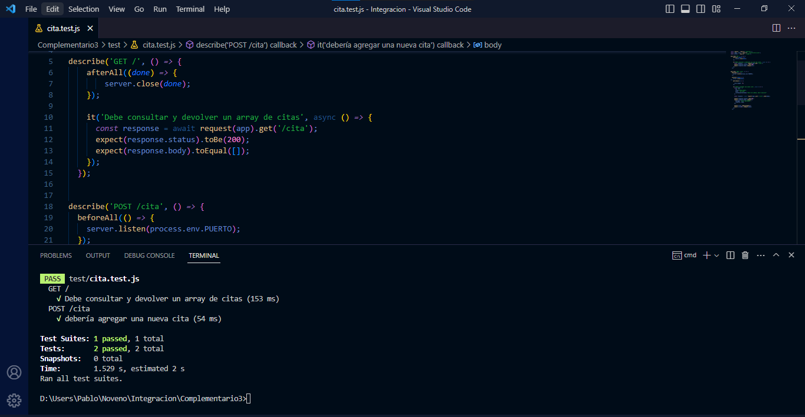

# COMPLEMENTARIO 3 

##EVIDENCIA SOBRE API REST DE CITAS MÉDICAS -RUTAS GET Y POST
 

## EVIDENCIA SOBRE TEST EN REST DE CITAS MÉDICAS -RUTAS GET Y POST

## EVIDENCIA DE CREACION DE TAGS

## EVIDENCIA DE DESCARGA DE IMAGENES

## EVIDENCIA DE EJECUCION DE CONTENEDORES DESCARGADOS

